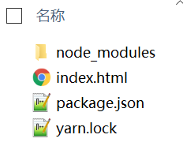

# 第一章节 语法学习
## JSX语法

将HTML代码插入JavaScript中

```xml
<div id="root"></div>
<script type="text/babel">
  ReactDOM.render(
    <h1>Hello, world!</h1>,
    document.getElementById('root')
  );
</script>
```

```javascript
const name = 'Jack';
const element = <h1 tabIndex="0" className="red">Hello, {name}</h1>;

ReactDOM.render(
  element,
  document.getElementById('root')
);
```

> **警告：**
>
> 因为 JSX 语法上更接近 JavaScript 而不是 HTML，所以 React DOM 使用 `camelCase`（小驼峰命名）来定义属性的名称，而不使用 HTML 属性名称的命名约定。
>
> 例如，JSX 里的 `class` 变成了 `className`，而 `tabindex` 则变为 `tabIndex`。

**优点**：

- 执行速度更快
- 定义虚拟DOM，更简单快捷编写模板

## 基础知识

### 编写Hello World

#### cdn

- https://unpkg.com/react@16/umd/react.development.js
- https://unpkg.com/react-dom@16/umd/react-dom.development.js
- https://unpkg.com/babel-standalone@6/babel.min.js

#### 基本语法

- ReactDOM.render()（渲染标签）
- React.createElement()（创建元素，添加属性）
- React.Component（创建组件，继承组件）

#### demo

```html
<!DOCTYPE html>
<html lang="en">
<head>
    <meta charset="UTF-8">
    <meta name="viewport" content="width=device-width, initial-scale=1.0">
    <title>cdn-react-start</title>
    <script crossorigin src="https://unpkg.com/react@16/umd/react.development.js"></script>
    <script crossorigin src="https://unpkg.com/react-dom@16/umd/react-dom.development.js"></script>
</head>
<body>
    <div id="app"></div>
    <script>
        const hello = React.createElement('h1', {}, 'Hello World!')
        ReactDOM.render(hello, document.getElementById('app'));
    </script>
</body>
</html>
```


另外可以使用yarn的方式下载对应的包

```html
yarn add react react-dom --save

// 修改为引入
<script src="node_modules/react/umd/react.development.js"></script>
<script src="node_modules/react-dom/umd/react-dom.development.js"></script>
```



#### babel

引入babel文件，将**ES5转化成ES6语法**，简化语法

```xml
<script src="https://unpkg.com/babel-standalone@6/babel.js"></script>
<body>
    <div id="app"></div>
    <script type="text/babel">
        ReactDOM.render(
            <h1>hello World!</h1>
        , document.getElementById('app'));
    </script>
</body>
```

> 下一篇：[02-元素渲染](../02-元素渲染/)