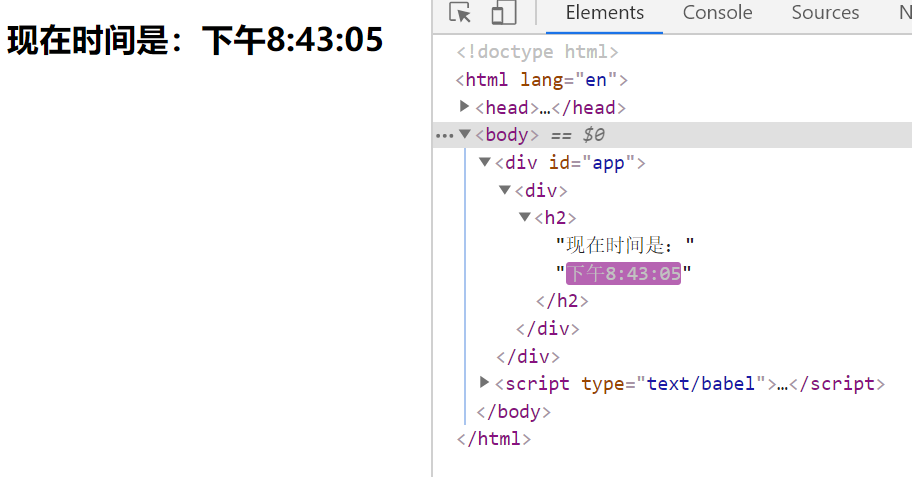

# 第二章节 元素渲染

react是一个MVC框架，当模型改变以后会渲染视图，当视图放生变化以后，也可以获取当它的状态，当元素的状态发生变化的时候，会拿现在的状态与之前的状态进行对比，比差异的部分渲染都页面上去。不会重复地插入跟渲染，这也是为什么这一种类型的框架会比之前的框架效率要高的原因。

写一个实时变化的时间

```xml
<div id="app"></div>
<script type="text/babel">
    function tick() {
		var time = new Date().toLocaleTimeString();
		var ele = <div>
			<h2>现在时间是：{time}</h2>
		</div>;
		ReactDOM.render(ele, document.getElementById('app'));
	}
	setInterval(tick, 1000);
</script>
```



可以看到这时候更新的是时间，而 '现在时间是'这个元素没有变化，这就是react在元素渲染上的好处，不会更新整个h2标签，只是在有差异的地方进行更改，效率会比较高的。


> 上一篇：[01-语法学习](../01-语法学习/)
> 下一篇：[03-组件和Props](../03-组件和Props/)