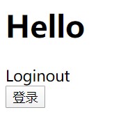
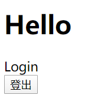

# 第六章节 条件判断

我们可以通过状态的变化来显示和加载不同的组件

这里有一个App组件，控制登陆和未登录组件的显示

初始化状态可以在constructor里面进行定义，也可以在react实例里面直接定义,默认情况下是处于未登录状态，也就是一开始是未登录的组件

```javascript
constructor(props){
    // 初始化状态
    this.state = {
        isLogin:false
    }
}
state = {
    isLogin: false
}
```

当点击按钮时让App显示登陆状态

```javascript
<div id="app"></div>
<script type="text/babel">
    function Login(){
        return <div>Login</div>
    }
    function Logout(){
        return <div>Loginout</div>
    }
    class App extends React.Component{
        state = {
            isLogin: false,
            text: '登录'
        }
        login = ()=>{
            let {isLogin, text} = this.state;// ES6结构语法
            this.setState({
                isLogin: !isLogin,
                text: text == '登录' ? '登出': '登录'
            })
        }
        render(){
            let {isLogin, text} = this.state; 
            let button;
            if(isLogin){
                button = <Login/>
            }else{
                button = <Logout/>
            }

            return <div>
                <h1>Hello</h1>
                {button}
                <button onClick={this.login}>{text}</button>
            </div>;
        }
    }
    ReactDOM.render(
        <App/>
    , document.getElementById('app'));
</script>
```



简化为三元表达式

```javascript
render(){
    let {isLogin, text} = this.state; // ES6结构语法
    return <div>
        <h1>Hello</h1>
        {isLogin?<Login/>:<Logout/>}
        <button onClick={this.login}>{text}</button>
    </div>;
}
```

Vue的话，对数据进行赋值就可以改变状态，而react跟小程序很像，需要用`this.setState()`去对数据进行赋值，调用了`this.setState()`就会引起`render`的执行，才能更新视图。


> 上一篇：[05-事件处理](../05-事件处理/)
>
> 下一篇：[07-列表渲染](../07-列表渲染/)