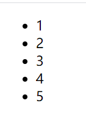

# 第七章 列表渲染

列表渲染的话，不像vue有v-for指令，在react中列表渲染就是对数据的循环，通过数组的一些方法并结合JSX语法糖来实现列表渲染。

这里有一个数组：`list:[1,2,3,4,5]`，我们可以将标签看做是一个js对象

可以通过map方法，for循环等

```javascript
<div id="app"></div>
<script type="text/babel">
    class List extends React.Component{
        state = {
            list: [1,2,3,4,5]
        }
        render(){
            const arr = this.state.list;
            const listItiem = []
            arr.map((item, index)=>{
                let li = <li key={index}>{item}</li>
                listItiem.push(li);
            })
            return <div>
                <ul>
                    {listItiem}
                </ul>
            </div>;
        }
    }
    ReactDOM.render(
        <List/>
    , document.getElementById('app'));
</script>
```



注意：

官方建议我们在每一个动态的标签添加key值，key可以帮我们去缓存，当组件发生变化的时候，会根据这个key变化进行识别出来，效率更高。

> 上一篇：[06-条件处理](../06-条件处理/)