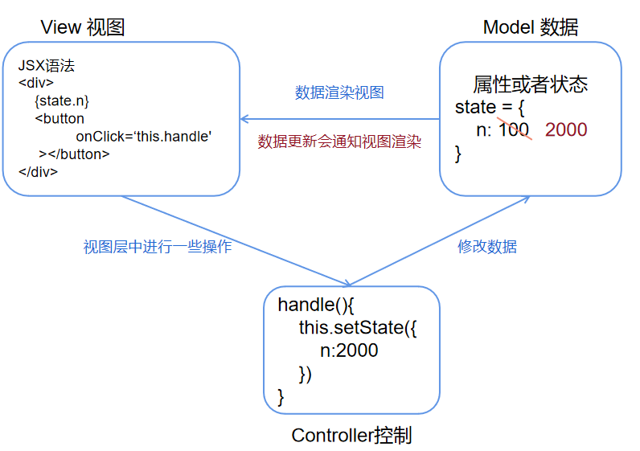
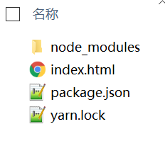
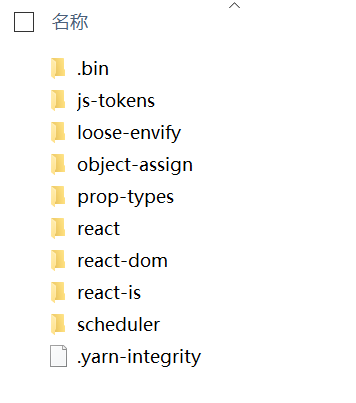
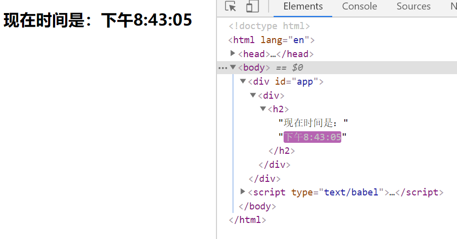
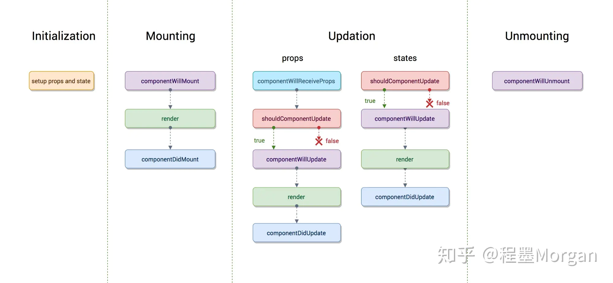
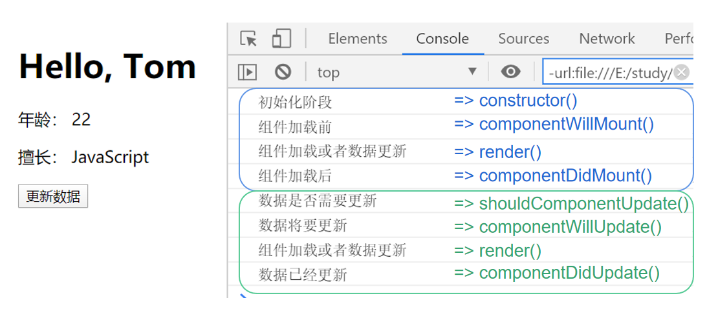
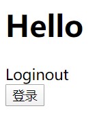
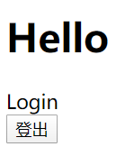
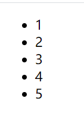

# React 学习之路

章节阅读：[React章节学习](https://hcq29.github.io/React-Learning/01-语法学习/)

# React介绍

**React** 是一个用于构建用户界面的 JavaScript 库。

是Facebook在2013年5月推出的面向视图层的前端开发框架，可以解决大型应用的开发，也可以帮助程序员很好的管理DOM。

## 知识点

- 编写HelloWorld
- JSX语法
- 元素渲染
- 组件和props（单页面运用，组件间传递数据）
- React生命周期
- 事件处理（绑定事件）
- 条件渲染
- 列表渲染

# 为什么要学习React？

- 高效、灵活、组件化、Virtual DOM（与真实DOM相比）...

- 企业大多技术栈是React，现在会Vue还不够。
- react使用的是MVC框架，单项响应的数据流。

# 回顾Vue

- vue是MVVM框架（model view viewModel）
- 处理
  - model： data（defineProperty GETTER/SETTER）、computed、vuex...
    - **数据层，在new Vue的时候会指定一个data响应式状态，还会指定computed计算属性，还有可能拿Vuex存储一些公共状态，数据的改变会影响视图，因为在data中我们用defineProperty 做了一个GETTER/SETTER**
  - view： template、el、render...
    - **视图层主要是指定模板或者是el跟render**
  - viewModel： **vue用来监听数据和视图的改变，从而实现双向数据绑定**

# MVC

MVC是一种代码的组织形式，

M是model，指的是数据层，V是View，指的是视图层，C是Controller，指的是控制层，

数据层中主要负责的是数据的管理，视图层是负责用户界面的呈现，C是负责View视图层中的一些业务逻辑，例如说监听鼠标事件和键盘事件，执行到如果让数据变化的话，控制层会更新model层，然后数据渲染视图。

react相当于MVC中的V，因为它把所有要操作的数据跟操作都写在JSX语法模板中。它做的事包括，监听数据的更新，当数据更新后，帮助我们去渲染视图（DOM DIFF 、虚拟DOM变为真实DOM）

相比Vue来说

- 试图更新并没有改变数据（MVC是单向的）
- 如果需要数据的更新，则需要自己在Controller中单独处理




# JSX语法

将HTML代码插入JavaScript中

```xml
<div id="root"></div>
<script type="text/babel">
  ReactDOM.render(
    <h1>Hello, world!</h1>,
    document.getElementById('root')
  );
</script>
```

```javascript
const name = 'Jack';
const element = <h1 tabIndex="0" className="red">Hello, {name}</h1>;

ReactDOM.render(
  element,
  document.getElementById('root')
);
```

> **警告：**
>
> 因为 JSX 语法上更接近 JavaScript 而不是 HTML，所以 React DOM 使用 `camelCase`（小驼峰命名）来定义属性的名称，而不使用 HTML 属性名称的命名约定。
>
> 例如，JSX 里的 `class` 变成了 `className`，而 `tabindex` 则变为 `tabIndex`。

**优点**：

- 执行速度更快
- 定义虚拟DOM，更简单快捷编写模板

# 基础知识

## 编写Hello World

### cdn

- https://unpkg.com/react@16/umd/react.development.js
- https://unpkg.com/react-dom@16/umd/react-dom.development.js
- https://unpkg.com/babel-standalone@6/babel.min.js

### 基本语法

- ReactDOM.render()（渲染标签）
- React.createElement()（创建元素，添加属性）
- React.Component（创建组件，继承组件）

### demo

```html
<!DOCTYPE html>
<html lang="en">
<head>
    <meta charset="UTF-8">
    <meta name="viewport" content="width=device-width, initial-scale=1.0">
    <title>cdn-react-start</title>
    <script crossorigin src="https://unpkg.com/react@16/umd/react.development.js"></script>
    <script crossorigin src="https://unpkg.com/react-dom@16/umd/react-dom.development.js"></script>
</head>
<body>
    <div id="app"></div>
    <script>
        const hello = React.createElement('h1', {}, 'Hello World!')
        ReactDOM.render(hello, document.getElementById('app'));
    </script>
</body>
</html>
```


另外可以使用yarn的方式下载对应的包

```html
yarn add react react-dom --save

// 修改为引入
<script src="node_modules/react/umd/react.development.js"></script>
<script src="node_modules/react-dom/umd/react-dom.development.js"></script>
```




### babel

引入babel文件，将**ES5转化成ES6语法**，简化语法

```xml
<script src="https://unpkg.com/babel-standalone@6/babel.js"></script>
<body>
    <div id="app"></div>
    <script type="text/babel">
        ReactDOM.render(
            <h1>hello World!</h1>
        , document.getElementById('app'));
    </script>
</body>
```


## 元素渲染

react是一个MVC框架，当模型改变以后会渲染视图，当视图放生变化以后，也可以获取当它的状态，当元素的状态发生变化的时候，会拿现在的状态与之前的状态进行对比，比差异的部分渲染都页面上去。不会重复地插入跟渲染，这也是为什么这一种类型的框架会比之前的框架效率要高的原因。

写一个实时变化的时间

```xml
<div id="app"></div>
<script type="text/babel">
    function tick() {
    	var time = new Date().toLocaleTimeString();
    	var ele = <div>
    		<h2>{time}</h2>
    	</div>;
    	ReactDOM.render(ele, document.getElementById('app'));
    }
    setInterval(tick, 1000);
</script>
```



可以看到这时候更新的是时间，而 '现在时间是'这个元素没有变化，这就是react在元素渲染上的好处，不会更新整个h2标签，只是在有差异的地方进行更改，效率会比较高的。

## 组件和props

组件一般是指UI级别的组件，而模块是指功能上的模块，在页面多，且有相似的功能的时候，需要用到组件，比如头部和底部。把这些都抽取出来，在一个地方修改，其他都可以发生变化，这样的话可以让开发效率更高，否则在每个页面都需要修改的话，成本就会很高。

### 组件的创建方式

#### <del>React.createClass()</del>

最早期版本，后面废弃了

#### 函数式组件（无状态组件）

该方式没有状态，没有生命周期，直接去加载就可以用

```javascript
function Hello(props) {
    return <div>
        <h1>Hello, {props.name}</h1>
        <p>年龄： {props.age}</p>
        <p>擅长： JavaScript</p>
    </div>;
}
ReactDOM.render(
    <Hello name="Jack" age="20"/>
, document.getElementById('app'));
```

#### React.Component

带状态组件，这种方法中的this指向React.Component的实例，具有生命周期

```javascript
// React.Component(有状态的)
class HelloJack extends React.Component{
    render(){
        return <div>
            <h1>Hello, {this.props.name}</h1>
            <p>年龄： {this.props.age}</p>
            <p>擅长： JavaScript</p>
        </div>;
    }
}
ReactDOM.render(
    <HelloJack name="Jack" age="20"/>
, document.getElementById('app'));
```

## React生命周期

在了解代码的执行过程和顺序，就需要生命周期，会暴露出不同的构造函数，在构造函数里面就可以做很多操作，分四个阶段：

- 组件初始化阶段
  - 负责属性和状态的初始化
- 组件加载阶段
  - 加载组件，可获取属性值等等
- 数据更新阶段
  - 组件加载完后，涉及到组件上的属性发生变化的时候，我们需要更新
- 组件销毁阶段




```javascript
class Hello extends React.Component{
    constructor(props){
        console.log('初始化阶段')
        // 初始化props
        super(props)
        // 初始化状态
        this.state = {
            name: 'Jack',
            age: 30
        }
    }
    // 必须使用箭头函数，让this指向react实例，因为button指定事件的话，默认this指向button
    updateUser = ()=>{
        this.setState({
            name: 'Tom',
            age: 22
        })
    }
    componentWillMount(){
        console.log('组件加载前')
    }
    componentDidMount(){
        console.log('组件加载后')
    }
    shouldComponentUpdate(){
        console.log('数据是否需要更新')
        return true;
    }
    componentWillUpdate(){
        console.log('数据将要更新')
    }
    componentDidUpdate(){
        console.log('数据已经更新')
    }
    render(){
        console.log('组件加载或者数据更新')
        return <div>
            <h1>Hello, {this.state.name}</h1>
            <p>年龄： {this.state.age}</p>
            <p>擅长： JavaScript</p>
            <button onClick={this.updateUser}>更新数据</button>
        </div>;
    }
}
ReactDOM.render(
    <Hello/>
, document.getElementById('app'));

```



- 组件加载前可以请求数据提前存储
- 初始化阶段可以初始化默认值

## 事件处理

将事件的this指向当前组件实例的三种方法：

### 方法一：箭头函数

在组件中定义事件，需要使用箭头函数，这样才能够让this指向React实例，不然像下面这样的话，打印的是undefined，使用箭头函数的话，this指向的就是Hello这个组件。

```javascript
class Hello extends React.Component{
    // 错误写法，this为undefined
    // updateUser(){
    //     console.log(this) // =>undefined
    // }
    click = ()=>{
        console.log(this) //  =>Hello{...}
    }
    render(){
        return <div>
            <h1>Hello world</h1>
            <button onClick={this.click}>点击</button>
        </div>;
    }
}
ReactDOM.render(
    <Hello/>
, document.getElementById('app'));
```

### 方法二：bind方法

在constructor内部绑定指针

```javascript
constructor(props){
    // 初始化props
    super(props)
    // 初始化状态
    this.state = {
        name: 'Jack',
        age: 30
    }
    this.click = this.click.bind(this) // 改变this的指向，但不调用函数方法，使用bind
}
click(){
    console.log(this) // =>Hello{...}
}
```

### 方法三：定义时指定作用域

```javascript
class Hello extends React.Component{
    click(){
        console.log(this)
    }
    render(){
        return <div>
            <h1>Hello world</h1>
            <button onClick={()=>this.click()}>点击</button>
        </div>;
    }
}
ReactDOM.render(
    <Hello/>
, document.getElementById('app'));
```

### 方法四：定义时改变作用域

```javascript
<button onClick={this.click.bind(this)}>点击</button>
```

## 条件判断

我们可以通过状态的变化来显示和加载不同的组件

这里有一个App组件，控制登陆和未登录组件的显示

初始化状态可以在constructor里面进行定义，也可以在react实例里面直接定义,默认情况下是处于未登录状态，也就是一开始是未登录的组件

```javascript
constructor(props){
    // 初始化状态
    this.state = {
        isLogin:false
    }
}
state = {
    isLogin: false
}
```

当点击按钮时让App显示登陆状态

```javascript
<div id="app"></div>
<script type="text/babel">
    function Login(){
        return <div>Login</div>
    }
    function Logout(){
        return <div>Loginout</div>
    }
    class App extends React.Component{
        state = {
            isLogin: false,
            text: '登录'
        }
        login = ()=>{
            let {isLogin, text} = this.state;// ES6结构语法
            this.setState({
                isLogin: !isLogin,
                text: text == '登录' ? '登出': '登录'
            })
        }
        render(){
            let {isLogin, text} = this.state; 
            let button;
            if(isLogin){
                button = <Login/>
            }else{
                button = <Logout/>
            }

            return <div>
                <h1>Hello</h1>
                {button}
                <button onClick={this.login}>{text}</button>
            </div>;
        }
    }
    ReactDOM.render(
        <App/>
    , document.getElementById('app'));
</script>
```



简化为三元表达式

```javascript
render(){
    let {isLogin, text} = this.state; // ES6结构语法
    return <div>
        <h1>Hello</h1>
        {isLogin?<Login/>:<Logout/>}
        <button onClick={this.login}>{text}</button>
    </div>;
}
```

Vue的话，对数据进行赋值就可以改变状态，而react跟小程序很像，需要用`this.setState()`去对数据进行赋值，调用了`this.setState()`就会引起`render`的执行，才能更新视图。

## 列表渲染

列表渲染的话，不像vue有v-for指令，在react中列表渲染就是对数据的循环，通过数组的一些方法并结合JSX语法糖来实现列表渲染。

这里有一个数组：`list:[1,2,3,4,5]`，我们可以将标签看做是一个js对象

可以通过map方法，for循环等

```javascript
<div id="app"></div>
<script type="text/babel">
    class List extends React.Component{
        state = {
            list: [1,2,3,4,5]
        }
        render(){
            const arr = this.state.list;
            const listItiem = []
            arr.map((item, index)=>{
                let li = <li key={index}>{item}</li>
                listItiem.push(li);
            })
            return <div>
                <ul>
                    {listItiem}
                </ul>
            </div>;
        }
    }
    ReactDOM.render(
        <List/>
    , document.getElementById('app'));
</script>
```



# 环境搭建

## create-react-app

create-react-app脚手架是基于Webpack + ES6 ，可以快速搭建react开发环境，执行以下命令创建项目：

```bash
$ npm install -g create-react-app
$ create-react-app my-app
$ cd my-app/
$ npm start
```

## 初试文件目录结构

```
my-app
├── README.md 项目介绍
├── node_modules  存放 npm 安装的工具包 或 模块
├── package.json  npm包配置文件，里面定义了项目的npm脚本，依赖包等信息
├── .gitignore  git的选择性上传的配置文件
├── public  静态资源，公用模板和图标等
│   ├── favicon.ico  网站图标
│   ├── index.html  首页的模板文件
│   └── manifest.json  移动端配置文件
└── src  源码目录，存放开放源代码
    ├── App.css
    ├── App.js  方法模块
    ├── App.test.js
    ├── index.css
    ├── index.js  项目的入口文件
    ├── logo.svg
    └── serviceWorker.js
    └── setupTests.js
```

问题：目录规范

参考其他项目整合项目目录结构

```
├── build          ----------------------网页配置
│   ├── favicon.ico  
│   └── manifest.json 
├── config            ------------------webpack配置
├── package-lock.json
├── package.json    --------------------项目package.json
├── README.md      ----------------------README
├── public          --------------------出口
│   ├── favicon.ico
│   ├── index.html
│   └── manifest.json
├── scripts        ---------------------运行的脚本
│   ├── build.js
│   ├── start.js
│   └── test.js
└── src           ----------------------源码目录
    ├── api       ----------------------API目录
    │   ├── api.js
    │   └── server.js
    ├── assets   -----------------------资源目录
    │   └── iconfont -------------------iconfont目录
    ├── components   -------------------公共组件
    │   └── ......
    ├── config    ----------------------项目一些配置
    │   ├── envconfig.js  --------------配置信息
    │   └── rem.js  --------------------自适应
    ├── pages       --------------------页面目录
    │   ├── home    --------------------主页页面
    |   ├── login   ---------------------商店页面
    │   └── ... 
    ├── router   -----------------------路由
    │   └── index.js
    ├── store   ------------------------react-redux状态管理目录
    │   ├── store.js
    │   └── user
    ├── style   ------------------------通用样式目录
    │   ├── base.scss
    │   ├── mixin.scss
    │   └── swiper.min.css
    └── utils  ------------------------公用方法
    │   ├── asyncComponent.jsx  -------异步加载组件
    │   └── commons.js  ---------------公用方法
    ├── App.css
    ├── App.js  方法模块
    ├── App.test.js
    ├── index.css
    ├── index.js   ---------------------项目的入口文件
    ├── logo.svg
    ├── serviceWorker.js ---------------热加载
    └── setupTests.js

```


>gitHub搜索技巧
>
>```bash
>in:name react stars:>3000
>```
>
>- 语言
>  - language:javascript
>
>- 项目名：
>  - in:name react
>
>- 项目描述
>  - in:deacription 爬虫
>
>- README
>  - in:readme react
>
>- star数
>  - stars:>3000
>
>- fork
>  - fork:>1500
>
>- 更新日期
>  - pushed:>2020-03-01
>