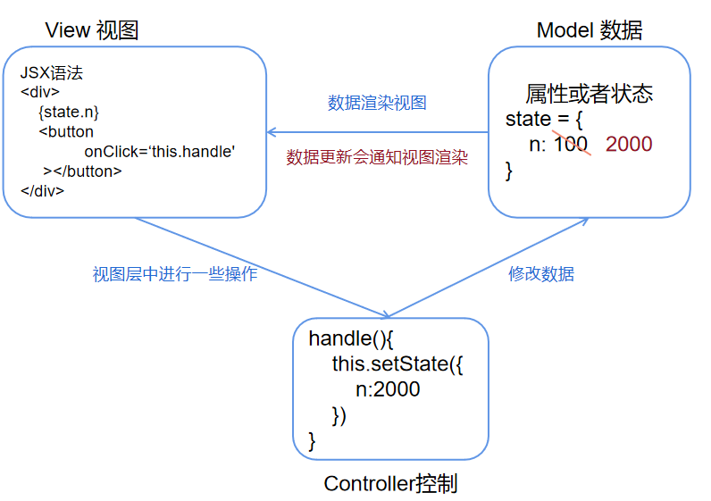

# React 学习之路

在线阅读：https://hcq29.github.io/React-Learning/

## React介绍

**React** 是一个用于构建用户界面的 JavaScript 库。

是Facebook在2013年5月推出的面向视图层的前端开发框架，可以解决大型应用的开发，也可以帮助程序员很好的管理DOM。

## 为什么要学习React？

- 高效、灵活、组件化、Virtual DOM（与真实DOM相比）...

- 企业大多技术栈是React，现在会Vue还不够。
- react使用的是MVC框架，单项响应的数据流。

## 回顾Vue

- vue是MVVM框架（model view viewModel）
- 处理
  - model： data（defineProperty GETTER/SETTER）、computed、vuex...
  - view： template、el、render...
  - viewModel： vue用来监听数据和视图的改变，从而实现双向数据绑定

# MVC

MVC是一种代码的组织形式，

M是model，指的是数据层，V是View，指的是视图层，C是Controller，指的是控制层，

数据层中主要负责的是数据的管理，视图层是负责用户界面的呈现，C是负责View视图层中的一些业务逻辑，例如说监听鼠标事件和键盘事件，执行到如果让数据变化的话，控制层会更新model层，然后数据渲染视图。

react相当于MVC中的V，因为它把所有要操作的数据跟操作都写在JSX语法模板中。它做的事包括，监听数据的更新，当数据更新后，帮助我们去渲染视图（DOM DIFF 、虚拟DOM变为真实DOM）

相比Vue来说

- 试图更新并没有改变数据（MVC是单向的）
- 如果需要数据的更新，则需要自己在Controller中单独处理

